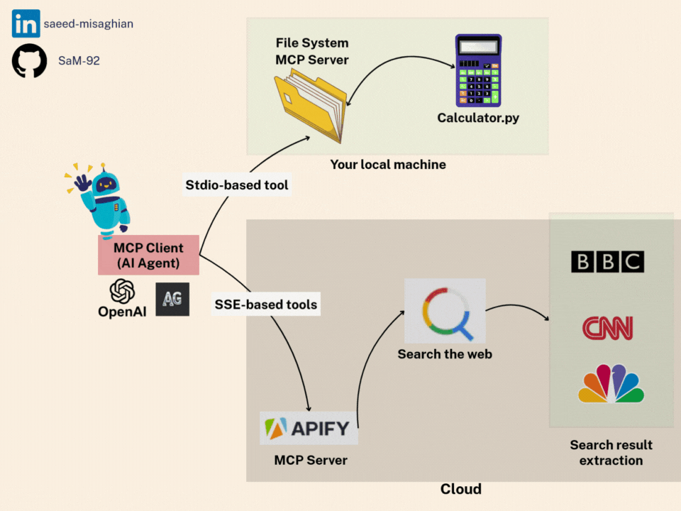

# 🤖 MCP Server Examples with AutoGen

This repository provides a practical demonstration of integrating tools with AI agents using the **Model Context Protocol (MCP)** within the **AutoGen** framework.

**Key Features Demonstrated:**

- **Dual MCP Integration:** Shows how to connect an AutoGen agent to:
  - A **local tool server** (`math_server.py`) using **Stdio** transport.
  - A **remote tool server** (Apify's RAG Web Browser Actor) using **Server-Sent Events (SSE)** transport.
- **Local Tool Example:** A simple calculator (`add`, `multiply`) running locally via `math_server.py`.
- **Remote Tool Example:** Leveraging Apify's [RAG Web Browser Actor](https://apify.com/apify/rag-web-browser) via their [MCP Server](https://apify.com/apify/actors-mcp-server) for web searching and content retrieval.
- **AutoGen Agent:** An `AssistantAgent` configured to utilize both sets of tools to answer user queries.

**Goal:** To illustrate the flexibility of MCP in enabling AI agents to access diverse tools, whether hosted locally or remotely, through standardized communication protocols (Stdio and SSE).

**Scenario:** The example agent answers two distinct questions:

1.  A math problem (`(3 + 5) x 12?`), expected to use the local `math_server.py`.
2.  A request for recent news ("Summarise the latest news of Iran and US negotiations..."), expected to use the remote Apify web browsing tool.



## 📚 Libraries & Frameworks Used

- **AutoGen**: AI agent framework (autogen_agentchat, autogen_core, autogen_ext)
- **MCP**: Model Context Protocol for tool integration
- **Python-dotenv**: For environment variable management
- **OpenAI API**: For LLM capabilities
- **Apify API**: For web browsing capabilities

## 🛠️ Setup

Follow these steps carefully to set up your environment:

1. **Prerequisites**:

   - Ensure you have **Python 3.12** installed.
   - Install `uv` if not already installed:
     ```bash
     pip install uv
     ```

2. **Navigate to Project Directory**:

   ```bash
   cd mcp_autogen_sse_stdio
   ```

3. **Create and Activate Virtual Environment**:

   ```bash
   # Create virtual environment using uv
   uv venv --python 3.12

   # Activate the virtual environment
   source .venv/bin/activate  # On macOS/Linux
   # OR
   .\.venv\Scripts\activate  # On Windows
   ```

4. **Install Dependencies**:

   ```bash
   # Install project dependencies
   uv pip install -e .
   ```

   **Troubleshooting Note**: If you encounter any issues with the MCP CLI installation, you can manually install it:

   ```bash
   uv add "mcp[cli]"
   ```

5. **Configure Environment Variables**:
   - Create a `.env` file in the `mcp_autogen_sse_stdio` directory.
   - Add your API keys:
     ```dotenv
     OPENAI_API_KEY=your_openai_api_key_here
     APIFY_API_KEY=your_apify_api_key_here
     ```
   - Get your Apify API key from [Apify MCP Server page](https://apify.com/apify/actors-mcp-server)

## 🚀 Running the Project

1. Make sure you're in the parent directory (one level up from the project directory):

   ```bash
   cd ..
   ```

2. Run the main script using `uv`:
   ```bash
   uv run mcp_autogen_sse_stdio/main.py
   ```

This will run the demo that:

1. Summarizes news about Iran-US negotiations using the Apify tool
2. Solves a simple math problem: `(3 + 5) x 12` using the local math tool

## 🔌 Understanding MCP (Model Context Protocol)

MCP is a protocol that standardizes communication between AI models and tools. This example demonstrates two ways to use MCP:

### 1. Local Tools (StdioServerParams)

- Uses standard input/output for communication
- Tools run locally on your machine
- Example: Our `math_server.py` provides simple math operations

### 2. Remote Tools (SseServerParams)

- Uses Server-Sent Events (SSE) for communication
- Tools run on remote servers (like Apify)
- Example: Web browsing capabilities via Apify's rag-web-browser

## 📝 Code Walkthrough

Our `main.py` demonstrates:

1. **Environment Setup**:

   - Loads API keys and validates them

2. **Tool Configuration**:

   - Sets up local math tools using StdioServerParams
   - Connects to Apify's web browser using SseServerParams (API from https://apify.com/apify/actors-mcp-server)

3. **Agent Creation**:

   - Creates an AutoGen assistant with both tool sets
   - Uses GPT-4 as the base model

4. **Task Execution**:
   - Runs two demo tasks showing both tools in action
   - Web browsing for news summarization
   - Math calculations for arithmetic problem

## 🔄 Communication Flow

```
User → AutoGen Agent → MCP Tools → Results → User
```

This example shows how easily different tool types can be integrated into one agent using MCP!
